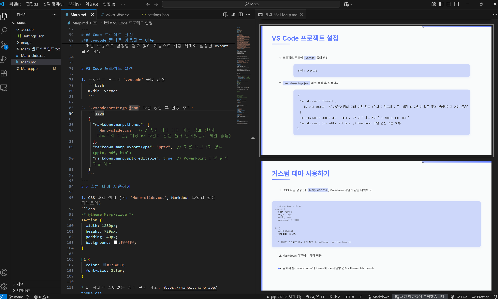

<style scoped>
.center-title {
  display: flex;
  flex-direction: column;
  justify-content: center;
  align-items: center;
  margin-top : 100px;
}
.center-title h1 {
  text-align: center;
  margin-bottom: 30px;
}
</style>

<div class="center-title">
  <h1>Marp (Markdown Presentation Ecosystem)</h1>
  
</div>

---

# Marp란?

### Marp는 **Ma**rkdown **P**resentation Ecosystem의 약자로:
- 마크다운으로 프레젠테이션을 만들 수 있는 도구
- 직관적이고 간단한 문법
- CommonMark 기반의 마크다운 사용
  - CommonMark : 마크다운(Markdown)”이라고 부르는 문법의 표준화된 버전
- HTML, PDF, PowerPoint로 export 가능

---

# VS Code에서 Marp 사용하기

1. VS Code 설치
2. VS Code에서 'Marp for VS Code' 확장 프로그램 설치  
   

3. 마크다운 파일 생성 (.md)
4. 파일 상단에 Front-matter 추가: Front-matter가 없으면 일반 마크다운 미리보기만 표시되고 슬라이드 형태로 보이지 않음
```yaml
---
marp: true //VS Code에서 이 파일을 일반 마크다운이 아닌 Marp 슬라이드로 인식하게 함
theme: Marp-slide //사용할 테마를 지정. 현 상태는 Marp-slide라는 이름의 css 파일을 사용하겠다는 의미
paginate: true// 슬라이드 하단에 페이지 번호 표시
---
```
- 이외에도 `backgroundColor`, `backgroundImage`, `class` 등 설정 가능 - **Marp 공식 문서**: https://marpit.marp.app/directives

---

# VS Code 프로젝트 설정

### VS Code 설정을 하는 이유
- Front-matter만으로는 VS Code가 커스텀 테마를 찾지 못함
- 설정 없이는 기본 테마(default, gaia, uncover)만 사용 가능
- 내보내기 할 때마다 형식을 매번 선택해야 함
- 설정이 없으면 Marp-slide.css 같은 커스텀 테마가 적용되지 않아 에러 발생
- VS Code가 테마 파일의 위치를 모르기 때문에 명시적으로 알려줘야 함


### .vscode 폴더를 이용하는 이유
- 다른 프로젝트에 영향을 주지 않음 (프로젝트별 독립성)
- 팀원들과 동일한 설정 공유 가능
- Git을 통한 버전 관리 가능
- 매번 수동으로 설정할 필요 없이 자동으로 해당 테마와 설정한 export 옵션 적용

---
# VS Code 프로젝트 설정

1. 프로젝트 루트에 `.vscode` 폴더 생성
   ```bash
   mkdir .vscode
   ```

2. `.vscode/settings.json` 파일 생성 후 설정 추가:
   ```json
   {
     "markdown.marp.themes": [
       "Marp-slide.css"  // 사용자 정의 테마 파일 경로 (현재 디렉토리 기준, 해당 md 파일과 같은 폴더 안에있는게 제일 좋음)
     ],
     "markdown.marp.exportType": "pptx",  // 기본 내보내기 형식 (pptx, pdf, html)
     "markdown.marp.pptx.editable": true  // PowerPoint 파일 편집 가능 여부
   }
   ```
---
# 커스텀 테마 사용하기

1. CSS 파일 생성 (예: `Marp-slide.css`, Markdown 파일과 같은 디렉토리)
```css
/* @theme Marp-slide */
section {
  width: 1280px;
  height: 720px;
  padding: 40px;
  background: #ffffff;
}

h1 {
  color: #2c3e50;
  font-size: 2.5em;
}

* 더 자세한 스타일은 공식 문서 참고: https://marpit.marp.app/theme-css
```

2. Markdown 파일에서 테마 적용
- 앞에서 본 Front-matter의 theme에 css파일명 입력 - theme: Marp-slide
<!-- ```yaml
---
marp: true
theme: Marp-slide
paginate: true
---
``` -->

---

<!-- # 커스텀 테마 사용하기

### 주요 스타일링 포인트
- `section`: 슬라이드 기본 크기와 배경
- `h1`, `h2`, `h3`: 제목 스타일
- `ul`, `li`: 목록 스타일
- `code`, `pre`: 코드 블록
- `header`, `footer`: 머리글/바닥글

자세한 스타일링 옵션은 [Marp 공식 문서](https://marpit.marp.app/theme-css) 참고

--- -->

<!-- # VS Code에서 미리보기

<div class="two-columns">

<div class="left-column">

1. 단축키 사용: 
   - **Window**: `Ctrl+K V` (측면에 미리보기 열기)
   - **Mac**: `Cmd+K V` (측면에 미리보기 열기)

2. 또는 명령 팔레트에서 "Marp: Toggle Preview" 선택

</div>

<div class="right-column">



</div>

</div> -->

# VS Code에서 미리보기


<div>

1. 단축키 사용: 
   - **Window**: `Ctrl+K V` (측면에 미리보기 열기)
   - **Mac**: `Cmd+K V` (측면에 미리보기 열기)

</div>

<div class="img-middle">


</div>


---

# 내보내기 (Export)

VS Code에서 내보내기:
1. 명령 팔레트에서 "Marp: Export Slide Deck..." 실행
2. vscode에 선택한 형식으로 export 됨


---

# 개인적인 Marp 사용의 장점

<div class="two-columns">

<div class="left-column">

## 개발자 친화적
- 개발자에게 익숙한 **Markdown 문법** 사용
- 텍스트 기반이라 **버전 관리**(Git)가 용이함
- **AI 도움**을 받기 쉬움

## 디자인과 스타일링
- **CSS로 테마 커스터마이징** 가능
- `style`, `div`, `class`, `id` 등으로 **세부 조정** 가능

</div>

<div class="right-column">

## 생산성 향상
- PPT 구성과 디자인보다 **내용에 집중** 가능
- 템플릿을 한 번 만들면 **재사용성**이 높음
- 미적 감각이 부족해도 CSS 템플릿이나 AI 도움으로 해결 가능

</div>

</div>

---

# 참고 자료

## 공식 문서
- 공식 웹사이트: https://marp.app/
- GitHub: https://github.com/marp-team/marp
- Marp 디렉티브(옵션): https://marpit.marp.app/directives
- Marp CSS 테마 작성: https://marpit.marp.app/theme-css

## VS Code 관련
- VS Code 확장: [Marp for VS Code](https://marketplace.visualstudio.com/items?itemName=marp-team.marp-vscode)
- VS Code 확장 설명서: https://github.com/marp-team/marp-vscode